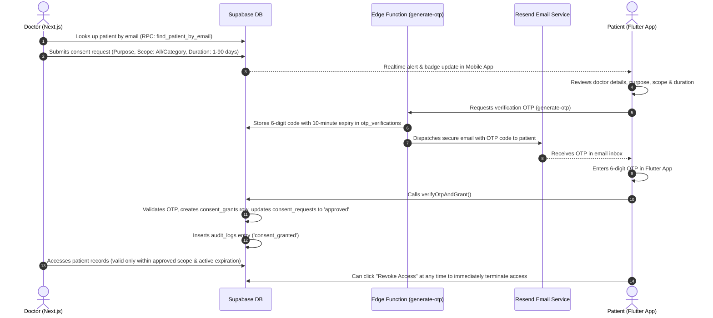

# MediLocker: Comprehensive System Audit & Architecture Report

> **Project Name:** MediLocker  
> **Repository:** `tejasbankar99/Medilocker`  
> **Audit Date:** September 15, 2026  
> **Prepared For:** Technical Evaluation, Hackathon Presentation (CRAFTVERSE), & Documentation  

---

## 1. Executive Summary

**MediLocker** is an end-to-end, patient-centric Electronic Health Records (EHR) management and secure exchange ecosystem. It addresses the critical challenges of fragmented physical health records, privacy vulnerabilities, and unauthorized data access in modern healthcare.

### Key Architectural Finding:
* **Consent Architecture:** The legacy concept of static QR-code based access has been fully upgraded to a **Zero-Trust, Dynamic OTP-Verified Consent Engine**.
* **Multi-Portal Ecosystem:** The platform operates on three distinct user portals:
  1. **Patient Mobile App (Flutter):** Secure health vault, chronological timeline, AI diagnostic analysis, and real-time consent approval/revocation.
  2. **Doctor Web Portal (Next.js):** Verified physician dashboard, patient search, granular access requests, and medical records viewer.
  3. **Admin Web Dashboard (Next.js):** Physician medical license verification, platform telemetry, and a centralized audit trail.
* **Intelligent Insights:** Integrated with **Google Gemini Flash** for observational report summarization and longitudinal parameter trend comparisons.
* **Security & Compliance:** Enforces PostgreSQL Row-Level Security (RLS), encrypted cloud storage, and an immutable audit trail aligned with Ayushman Bharat Digital Mission (ABDM) and HIPAA principles.

---

## 2. Technology Stack & Component Breakdown

```mermaid
graph TD
    subgraph Client Tier
        P["Patient Mobile App<br/>(Flutter & Dart)"]
        D["Doctor Web Portal<br/>(Next.js & Tailwind)"]
        A["Admin Web Portal<br/>(Next.js & Tailwind)"]
    end

    subgraph Backend & Logic Tier (Supabase)
        Auth["Supabase Auth<br/>(JWT & Roles)"]
        DB[("PostgreSQL Database<br/>(Row-Level Security)")]
        Storage["Supabase Storage<br/>(Encrypted Buckets)"]
        EF1["Edge Function: generate-otp"]
        EF2["Edge Function: analyze-document"]
        EF3["Edge Function: notify-consent"]
    end

    subgraph External Services
        Gemini["Google Gemini Flash API<br/>(Document AI)"]
        Resend["Resend Email API<br/>(OTP Delivery)"]
    end

    P -->|Auth & RLS Queries| DB
    P -->|Upload Documents| Storage
    D -->|Request Access & View| DB
    A -->|Verify Doctors & Audit| DB
    EF1 -->|Send Email OTP| Resend
    EF2 -->|Analyze Records| Gemini
    P -->|Verify OTP| EF1
    P -->|Trigger AI Analysis| EF2
```

| Layer | Technologies | Responsibilities |
| :--- | :--- | :--- |
| **Mobile App (Patient)** | Flutter (>= 3.0.0), Dart, Provider, GoRouter, Intl | Document uploading, category sorting, chronological health timeline, AI insights view, OTP consent verification, instant access revocation. |
| **Doctor Web Portal** | Next.js 14+ (App Router), TypeScript, Tailwind CSS | Doctor onboarding, license submission, patient lookup by email, request scoped access, consultation records viewer. |
| **Admin Dashboard** | Next.js 14+ (App Router), TypeScript, Tailwind CSS | Medical license approval/rejection, live ecosystem metrics, centralized compliance audit logging. |
| **Backend / Database** | Supabase (PostgreSQL 15), Row Level Security (RLS) | Relational database, role-based data isolation, stored procedures (`find_patient_by_email`), realtime subscriptions. |
| **Serverless Edge Functions** | Deno, TypeScript, Supabase Edge Runtime | `generate-otp`, `analyze-document`, `notify-consent`. |
| **AI Integration** | Google Gemini 1.5 / 3.6 Flash (`generativelanguage.googleapis.com`) | Clinical report summarization, bullet-point key findings, category comparison, parameter trend extraction. |
| **Mailing / 2FA Engine** | Resend Email API | Cryptographic 6-digit OTP delivery to patients' registered emails. |

---

## 3. Detailed Audit of Core Workflows

### 3.1. OTP-Based Dynamic Consent Architecture (Current Implementation)

The system replaces insecure physical sharing and static QR codes with a time-bound, two-factor authorized consent protocol:



#### Key Highlights:
1. **Granular Scoping:** Doctors cannot demand blanket access unless permitted. Access can be scoped to **"All Records"** or **Specific Categories** (*Lab Report, Prescription, Radiology, Cardiology, Vaccination, etc.*).
2. **Time-Limited Duration:** Consents are explicitly bounded (e.g., 1 day, 3 days, 7 days, 14 days, 30 days, or 90 days) via `expires_at` timestamps.
3. **Patient Sovereignty:** Patients can revoke any active doctor grant instantaneously from the mobile app.

---

### 3.2. Doctor Verification & Admin Governance Flow

To prevent unauthorized individuals from posing as doctors:
1. **Doctor Registration:** Doctor registers on the web portal and submits their Full Name, Email, Medical Specialty, Hospital Affiliation, and **Medical License Number**.
2. **Pending State:** Newly registered doctors have an initial status of `pending`. Their access to request patient records is blocked until approved.
3. **Admin Verification:** The administrator reviews the doctor's credentials and medical license inside `/admin/doctors`:
   * **Approve:** Updates `doctor_profiles.approval_status = 'approved'`, activates the `user_roles` entry, and enables clinical access.
   * **Reject:** Marks `approval_status = 'rejected'` and blocks access.
4. **Platform Telemetry:** Admin dashboard tracks real-time counts of:
   * Total Patients registered
   * Verified Doctors vs Pending Registrations
   * Active Consent Grants currently alive in the system
   * Total Audit Log entries recorded

---

### 3.3. AI-Powered Medical Insights Engine (`analyze-document`)

Rather than leaving patients confused by complex medical jargon, MediLocker employs Google Gemini Flash to parse reports:
* **Trigger:** Invoked automatically when a medical document is uploaded or requested.
* **Context Awareness:** The function fetches the current document along with the **previous document of the same category** to perform comparative analysis.
* **Extraction Schema:**
  * `summary`: 2–3 sentence plain-language overview of the document contents.
  * `key_findings`: Bullet-point list of notable clinical values or observations.
  * `comparison_with_previous`: Comparative analysis against previous historical reports in that category.
  * `parameter_changes`: Key-value map of specific biomarker changes (e.g., Blood Sugar, Cholesterol).
  * `health_trends`: Longitudinal trend observations across health visits.
* **Strict Ethical Guardrails:** System prompts enforce that the AI **must not diagnose conditions** and **must not prescribe medications**, acting purely as an observational aid.

---

### 3.4. Patient Health Locker & Interactive Timeline

* **Document Categorization:** Prescriptions, Lab Reports, Hospital Records, Doctor Notes, Vaccinations, Radiology, Cardiology, Dental, and Insurance.
* **Interactive Medical Timeline:** 
  * Groups records chronologically by Month and Year.
  * Multi-dimensional filtering: Filter by Category, Attending Doctor, Hospital Name, or custom Date Ranges.
  * Displays thumbnail previews, document metadata, and AI insight badges.

---

### 3.5. Security, Row-Level Security (RLS) & Audit Logging

* **Row-Level Security (RLS):**
  * `medical_documents`: Directly accessible only by the document owner (`user_id = auth.uid()`) OR by a doctor with an **active, non-revoked consent grant** whose `expires_at > now()`.
  * `consent_grants`: Manageable by the owning patient.
  * `doctor_profiles`: Readable by doctors and admins; modifiable only by admins.
* **Immutable Audit Trail (`audit_logs` table):**
  * Logs every critical event: `consent_requested`, `consent_granted`, `consent_rejected`, `consent_revoked`, and `document_viewed`.
  * Captures `actor_id`, `actor_role` (`patient` | `doctor` | `admin`), `action`, `target_type`, `patient_id`, `doctor_id`, and client metadata.
  * Centralized view available for system auditing under `/admin/audit`.

---

## 4. Database Schema Entities

| Table Name | Primary Purpose | Key Fields |
| :--- | :--- | :--- |
| `user_roles` | Role-based authorization | `user_id`, `role` (`patient`, `doctor`, `admin`), `is_active` |
| `patient_profiles` | Patient personal & medical profile | `user_id`, `full_name`, `blood_group`, `emergency_contact`, `date_of_birth` |
| `doctor_profiles` | Doctor credentials & verification status | `user_id`, `full_name`, `license_number`, `specialty`, `hospital`, `approval_status` |
| `medical_documents` | Stored medical records metadata | `user_id`, `title`, `category`, `file_url`, `file_type`, `doctor_name`, `document_date` |
| `consent_requests` | Doctor access requests | `doctor_id`, `patient_id`, `purpose`, `scope`, `scope_value`, `duration_days`, `status` |
| `consent_grants` | Active & expired access grants | `patient_id`, `doctor_id`, `request_id`, `scope`, `expires_at`, `is_revoked` |
| `otp_verifications` | 2FA tokens for consent authorization | `user_id`, `otp_code`, `purpose`, `reference_id`, `expires_at`, `is_used` |
| `ai_insights` | Gemini document analysis results | `document_id`, `user_id`, `summary`, `key_findings`, `parameter_changes`, `health_trends` |
| `audit_logs` | Immutable audit and compliance log | `actor_id`, `actor_role`, `action`, `target_id`, `patient_id`, `doctor_id`, `timestamp` |

---

## 5. Repository File Structure

```text
medilocker/
├── AUDIT.md                             <-- Complete system audit report
├── README.md                            <-- Project introduction
├── pubspec.yaml                         <-- Flutter project manifest
├── lib/                                 <-- Patient Mobile App (Flutter)
│   ├── config/                          <-- Supabase configurations
│   ├── models/                          <-- Data models (Document, Consent, Profile, AI Insight)
│   ├── providers/                       <-- State management (Auth, Document, Consent, Audit)
│   ├── router/                          <-- GoRouter route definitions
│   ├── screens/
│   │   ├── auth/                        <-- Login, registration, email verification
│   │   ├── consent/                     <-- Access approvals, OTP verification screen
│   │   ├── documents/                   <-- Vault, upload, and document details
│   │   ├── home/                        <-- Home dashboard with quick stats
│   │   ├── profile/                     <-- Profile management
│   │   ├── timeline/                    <-- Chronological filterable health timeline
│   │   └── shell/                       <-- Navigation shell with live badge indicator
│   └── widgets/                         <-- Reusable UI components (AI Insight Card, etc.)
│
├── web-portal/                          <-- Web Portals (Next.js + TypeScript + Tailwind)
│   ├── app/
│   │   ├── admin/                       <-- Admin Dashboard
│   │   │   ├── audit/                   <-- Centralized compliance audit log viewer
│   │   │   └── doctors/                 <-- Doctor license approval/rejection panel
│   │   ├── doctor/                      <-- Doctor Portal
│   │   │   ├── patients/                <-- Active patients & records viewer
│   │   │   └── request-access/          <-- Patient access request builder
│   │   ├── login/ & register/           <-- Authentication flows
│   │   └── api/register-doctor/         <-- Doctor registration API route
│   └── components/                      <-- Reusable web components (Sidebar, etc.)
│
└── supabase/                            <-- Backend & Serverless
    ├── phase1_schema.sql                <-- Database migrations & RLS policies
    └── functions/                       <-- Deno Edge Functions
        ├── generate-otp/                <-- Cryptographic OTP generator + Resend email dispatcher
        ├── analyze-document/            <-- Google Gemini Flash clinical document parser
        └── notify-consent/              <-- Realtime notification handler
```

---

## 6. Competitive Advantages & Hackathon Highlights (CRAFTVERSE)

1. **Zero-Trust Patient Sovereignty:** Doctors never hold persistent access; all permissions are scoped, time-limited, and revocable on-demand.
2. **Dual-Factor Consent Protocol:** Eliminates unverified access requests via cryptographically generated email OTPs.
3. **Preventing Doctor Impersonation:** Rigorous Admin verification workflow validates medical licenses prior to granting request capabilities.
4. **AI Without Diagnostic Hallucination:** Gemini Flash is constrained to structured parameter extraction and longitudinal comparison without generating risky medical prescriptions.
5. **Regulatory Alignment:** Built to align directly with the **Ayushman Bharat Digital Mission (ABDM)** and **HIPAA** guidelines for digital consent and auditability.
