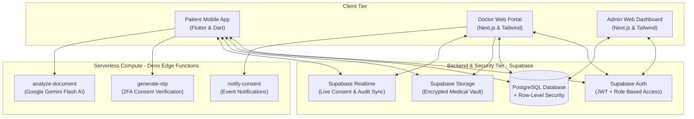

# MediLocker

> **Your Medical History, Anytime, Anywhere.**  
> An end-to-end, patient-centric Electronic Health Records (EHR) management and secure exchange platform built with **Flutter**, **Next.js**, and **Supabase**.

---

## Overview

**MediLocker** solves the problem of fragmented physical medical records, privacy vulnerabilities, and unauthorized health data access. It gives patients complete ownership of their medical history while enabling seamless, consent-driven sharing with verified healthcare providers.

### Multi-Portal Ecosystem
1. **Patient Mobile App (`lib/`)** — Cross-platform Flutter app featuring an encrypted health vault, chronological medical timeline, AI diagnostic report analysis, and real-time consent approval/revocation.
2. **Doctor Web Portal (`web-portal/app/doctor`)** — Next.js clinical dashboard for verified physicians to search patients, request scoped access, and review authorized records.
3. **Admin Web Dashboard (`web-portal/app/admin`)** — Centralized portal for verifying physician medical licenses, monitoring platform telemetry, and auditing data access.

---

## System Architecture



---

## Core Features

### 1. Zero-Trust, OTP-Verified Consent Engine
* **Scoped Access Requests:** Verified doctors can request access to **All Records**, **Specific Categories** (e.g., Cardiology, Lab Reports), or **Specific Documents** for a fixed duration (1 to 30 days).
* **Dual-Factor Patient Approval:** Approving a doctor's request triggers a 6-digit one-time password (OTP) verification to prevent unauthorized access on unlocked devices.
* **Instant Revocation:** Patients can revoke active doctor access at any time with a single tap, immediately terminating database and storage read permissions via PostgreSQL Row-Level Security (RLS).

### 2. AI-Powered Medical Insights (`analyze-document`)
* Powered by **Google Gemini Flash** via Supabase Edge Functions.
* Generates plain-language summaries, highlights key clinical findings, and compares biomarkers against previous reports in the same category to track longitudinal health trends.
* Built with strict clinical guardrails: provides observational summaries without diagnosing conditions or prescribing medication.

### 3. Encrypted Health Vault & Interactive Timeline
* Supports multi-format uploads (PDFs, images, camera capture) across 10 clinical categories: *Lab Report, Prescription, Hospital Record, Doctor Note, Vaccination, Radiology, Cardiology, Dental, Insurance, and Other*.
* Chronological timeline view with filtering by category, doctor, hospital, and date range.

### 4. Doctor Verification & Immutable Audit Trail
* Newly registered doctors start in a `pending` state and cannot request patient records until an administrator verifies their medical license number.
* Every sensitive action (`consent_requested`, `consent_approved`, `consent_revoked`, `document_viewed`, `document_uploaded`) is recorded in an immutable `audit_logs` table visible to both the patient and system administrators.

---

## Database Schema

| Table Name | Purpose | Key Fields |
| :--- | :--- | :--- |
| `user_roles` | Role-based authorization | `user_id`, `role` (`patient`, `doctor`, `admin`), `is_active` |
| `patient_profiles` | Patient personal & medical info | `user_id`, `full_name`, `blood_group`, `emergency_contact`, `date_of_birth` |
| `doctor_profiles` | Physician credentials & status | `user_id`, `full_name`, `license_number`, `specialty`, `hospital`, `approval_status` |
| `medical_documents` | Stored medical records metadata | `user_id`, `title`, `category`, `file_url`, `file_type`, `doctor_name`, `document_date` |
| `consent_requests` | Doctor access requests | `doctor_id`, `patient_id`, `purpose`, `scope`, `scope_value`, `duration_days`, `status` |
| `consent_grants` | Active & expired access grants | `patient_id`, `doctor_id`, `request_id`, `scope`, `expires_at`, `is_revoked` |
| `otp_verifications` | 2FA tokens for consent approval | `user_id`, `otp_code`, `purpose`, `reference_id`, `expires_at`, `is_used` |
| `ai_insights` | Gemini document analysis results | `document_id`, `user_id`, `summary`, `key_findings`, `parameter_changes`, `health_trends` |
| `audit_logs` | Immutable compliance & access log | `actor_id`, `actor_role`, `action`, `target_id`, `patient_id`, `doctor_id`, `created_at` |

---

## Project Structure

```text
medilocker/
├── lib/                                 # Patient Mobile App (Flutter)
│   ├── config/                          # Supabase client configuration
│   ├── models/                          # Data models (Document, Consent, Profile, AI Insight)
│   ├── providers/                       # Provider state management
│   ├── router/                          # GoRouter navigation & auth guards
│   ├── screens/                         # Auth, Home, Vault, Consent, Timeline, Audit, Profile
│   ├── theme/                           # App theme & design system
│   └── widgets/                         # Reusable UI components
├── web-portal/                          # Doctor & Admin Web Portals (Next.js + Tailwind CSS)
│   ├── app/
│   │   ├── admin/                       # Admin dashboard, doctor verification & audit logs
│   │   ├── doctor/                      # Doctor dashboard, patient view & access requests
│   │   ├── login/ & register/           # Web authentication pages
│   │   └── api/register-doctor/         # Doctor onboarding API route
│   ├── components/                      # Shared web UI components
│   └── lib/                             # Supabase client for Next.js
├── supabase/                            # Backend SQL & Serverless Functions
│   ├── phase1_schema.sql                # Core tables, RLS policies & storage setup
│   ├── fix_trigger.sql                  # Auth profile provisioning trigger
│   └── functions/                       # Deno Edge Functions (analyze-document, generate-otp, notify-consent)
├── test/                                # Unit & widget tests
└── AUDIT.md                             # Detailed system architecture & security audit report
```

---

## Getting Started

### 1. Backend Setup (Supabase)
1. Create a new project on [Supabase](https://supabase.com).
2. Run `supabase/phase1_schema.sql` and `supabase/fix_trigger.sql` in the Supabase SQL Editor.
3. Deploy the Edge Functions using the Supabase CLI:
   ```bash
   supabase functions deploy analyze-document
   supabase functions deploy generate-otp
   supabase functions deploy notify-consent
   ```

### 2. Patient Mobile App (Flutter)
```bash
git clone https://github.com/tejasbankar99/Medilocker.git
cd Medilocker
cp lib/config/supabase_config.example.dart lib/config/supabase_config.dart
# Add your Supabase URL and Anon Key in lib/config/supabase_config.dart
flutter pub get
flutter run
```

### 3. Doctor & Admin Web Portal (Next.js)
```bash
cd web-portal
cp .env.example .env.local
# Add NEXT_PUBLIC_SUPABASE_URL and NEXT_PUBLIC_SUPABASE_ANON_KEY in .env.local
npm install
npm run dev
```
Open [http://localhost:3000](http://localhost:3000) to access the Doctor and Admin portals.